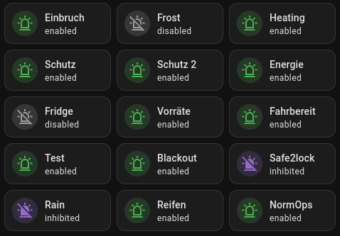

# miqro_alarm

This is a full-fledged alarm logic, completely based on MQTT inputs and outputs. Reliability was a top priority during development.

Features:

 * Listens to MQTT topics for alarm inputs
 * Custom conditions for alarms can be expressed, e.g., if a value rises above a certain threshold
 * Prealarms are supported - raise awareness to an issue before the full alarm is triggered, or allow time for disabling the alarm
 * Debouncing of input signals is supported, e.g., to avoid false alarms due to sensor noise
 * Alarm outputs:
    * Text messages sent to MQTT topics (e.g., an SMS gateway, push message provider, etc.) 
    * Switch outputs, i.e., MQTT topics expecting custom messages (e.g., to connect to other MQTT services or to drive lights, sirens, etc.)
        * Messages can be repeated in custom intervals
        * Different alarm schedules can be mapped to one topic, e.g., to show a different light pattern for intrusion alarms and fire alarms
 * Alarm groups capture multiple inputs and drive one or more alarm outputs
 * Comprehensive support for liveness checks:
    * If an MQTT topic is not received in a certain interval, send a notification
    * Ensure that other services are alive, send notification if they fail
    * Can call an external HTTP liveness check to ensure the alarm service is still running
 * Support for alarm inhibition (e.g., suppress an intrusion alarm when owner is at home)
 * Alarms can be switched on/off and observed via MQTT

See (examples/miqro.example.yml)[examples/miqro.example.yml] for configuration examples.

## Installing


To install the software, follow these steps **as root**:

 * If `pip3` is not installed, run `apt install python3-pip` first.
 * Then run `pip3 install miqro_alarm` 
 * Create the configuration file `/etc/miqro.yml`
   * See [examples/miqro.example.yml](examples/miqro.example.yml) for an example
   * See [the MIQRO documentation](https://github.com/danielfett/miqro#configuration-file) for other options you can use in the configuration file
 * Install the system service: 
   * `miqro_alarm  --install`
   * `systemctl enable miqro_alarm`
   * `systemctl start miqro_alarm`


## Configuration

The configuration is based on a few concepts:

 * **Outputs** define MQTT topics an alarm can be sent to. This can be:
   * A **text output**: This output is defined by a single MQTT topic that accepts a human-readable message, for example, an SMS gateway.
   * A **switch output**: Defines one or more MQTT topics that accept custom messages. This can be used to drive lights, sirens, etc. You can define separate MQTT topics for different alarm schedules, e.g., to show a different light pattern for intrusion alarms and fire alarms. For each alarm schedule, you can define the MQTT topic, the message that is sent when the alarm is activated, whether the message is to be repeated, and an MQTT topic and message that is sent when the alarm is deactivated.
 * **Alarm Groups** define a set of inputs that are to be monitored. If any of the inputs is triggered, the alarm for the group is activated. Each alarm group offers a number of configuration options:
   * Each group has a **name** that it used in the MQTT messages and a human-readable **label**.
   * The alarm group can be configured to trigger a number of    
     **outputs** at once. 
   * You can also define a **prealarm**, which is activated before the alarm is triggered. After a defined interval, the prealarm is deactivated and the alarm is triggered. 
   * You can define a number of **inputs**. Each input is defined by a single MQTT topic and a condition. If the condition is met, the input is triggered. Conditions can be defined using python expressions. You can define a number of conditions, e.g., if a value rises above a certain threshold or if a value is below a certain threshold. Additionally, there is a timeout for each input that you can define. If no message is received for the input in the defined interval, the input is considered to be dead and a notification will be sent.
   * You can define **liveness checks** for each alarm group: If a liveness check is not triggered in a certain interval, a notification is sent. This can be used, e.g., to check that a sensor sends data in a certain interval or that another service is still running.
   * You can define **inhibitors** for each alarm group. If an inhibitor is triggered, the alarm is inhibited. This can be used, e.g., to suppress an intrusion alarm when the owner is at home.

See (examples/miqro.example.yml)[examples/miqro.example.yml] for configuration examples and explanations.

### Optional Homeassistant Integration

When used with Homeassistant, the service publishes entities for every alarm. Each configured alarm is its own device.

#### Example: Interactive Alarm Overview

Automatically generated overview of all alarms. When clicking an active alarm, it is muted. If the alarm is not active, clicking toggles between enabled/disabled.

This requires the HACS plugins [entity-progress-card](https://github.com/francois-le-ko4la/lovelace-entity-progress-card) and [auto-entities](https://github.com/thomasloven/lovelace-auto-entities).



```yaml
type: custom:auto-entities
filter:
  include:
    - options:
        type: custom:entity-progress-card-template
        icon: >-
          {{ {'enabled': 'mdi:alarm-light-outline', 'disabled':
          'mdi:alarm-light-off-outline', 'prealarm': 'mdi:alarm-light', 'alarm':
          'mdi:alarm-light', 'inhibited':
          'mdi:alarm-light-off'}[state_attr('this.entity_id', 'display_state')]
          }}
        name: "{{device_attr('this.entity_id', 'name')[6:]}}"
        secondary: "{{ state_attr('this.entity_id', 'display_state') }}"
        force_circular_background: true
        color: >-
          {{ {'enabled': 'green', 'disabled': 'grey', 'prealarm': 'orange',
          'alarm': 'red', 'inhibited': 'purple'}[state_attr('this.entity_id',
          'display_state')] }}
        bar_color: red
        bar_effect: shimmer
        hide: progress_bar
        icon_tap_action:
          action: perform-action
          perform_action: button.press
          target:
            entity_id: this.entity_id
      device: Alarm*
      entity_id: button.*_on_off_reset
show_empty: true
card:
  type: grid
  square: false
card_param: cards
```

To show only active alarms, add the following (same indentation level as "device").

```yaml
      attributes:
        display_state: alarm
```

#### Example: Overview of Active Inputs

```markdown
type: markdown
content: >-
  

  

  ### {{ x.name }}

  
    * {{ z }}
  

  

  

```

### MQTT Topics

#### :outbox_tray: Published Topics 

**For each alarm group, the following topics are published:**

 * `service/alarm/GROUP1/state` — the state of alarm group GROUP1: `off`, `prealarm`, or `alarm`

 * `service/alarm/GROUP1/enabled/state` — `1` when the group is enabled, `0` otherwise

 * `service/alarm/GROUP1/inhibited/state` — `1` when the alarm is inhibited, `0` otherwise

 * `service/alarm/GROUP1/any_inhibitor_active` — `1` if alarm group is manually inhibited or via a defined inhibitor, `0` otherwise

 * `service/alarm/GROUP1/all_inputs_online` — `1` when all inputs of this group are live, `0` otherwise

 * `service/alarm/GROUP1/live` — `1` when all liveness checks for this group are OK and all inputs and inhibitors are live

 * `service/alarm/g1/display_state` — a unified view on the state of this alarm group: `disabled`, `inhibited`, `enabled`, `prealarm`, `alarm` — recommended for use in user interfaces

**For each input of the group:**

 * `service/alarm/GROUP1/input/INPUT1/state` — the state of this input: `invalid_response`, `unknown`, `offline`, or `online`

 * `service/alarm/GROUP1/input/INPUT1/value` — the last evaluated value for this alarm input — `1` or `0`

Same for each inhibitor (`../inhibitor/..`) and liveness check (`../liveness/..`) of the alarm group.

All outputs listed above are also published in a JSON object at `service/alarm/GROUP1/info`.

#### :inbox_tray: Subscribed Topics

The following topics can be used to control the alarm groups:


 * `service/alarm/GROUP1/enabled/command` — send `1` to enable alarm group, `0` to disable

 * `service/alarm/GROUP1/inhibited/command` — send `1` to (manually) inhibit alarm group, `0` to remove manual inhibition

 * `service/alarm/GROUP1/reset/command` — send `1` to reset the alarm when it is active (in `alarm` or `prealarm` state)

 * `service/alarm/GROUP1/reset/auto/command` — send `1` to reset the alarm, if it is in `alarm` or `prealarm` state; otherwise, the alarm is disabled or enabled — this is to be used in user interfaces

